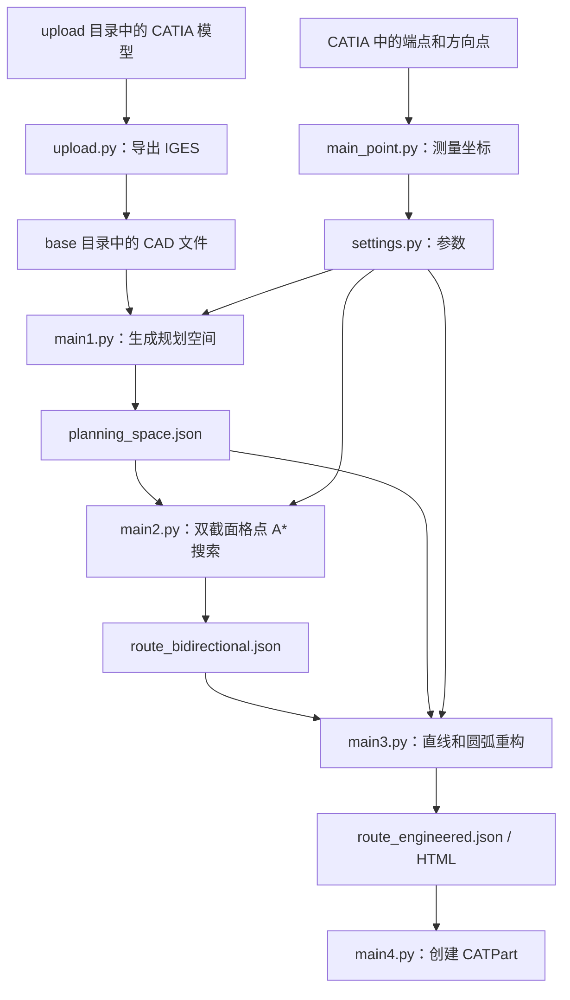

# Python 文件、功能模块与参数说明

适用目录：`D:\沈姚启\codex_waterpipe`。依据：2026-09-24 工作区内的 12 个 Python 源文件。本文解释当前代码实际执行的行为；本次只阅读源码和编写说明，没有运行 CATIA 转换、路径搜索或修改业务代码。

## 先看整体：这个项目在做什么

项目把车辆零件模型转换为可计算的空间，寻找管路中心线，再把中心线整理成直线与圆弧，最后可以回到 CATIA 建模。源代码和 README 仍有排气管、双向搜索等历史命名；是否已经满足水管的全部工艺要求，需要看具体校验逻辑，不能仅凭名称判断。



`pipeline.py` 只自动串联 `main_point.py → main1.py → main2.py → main3.py`。`upload.py` 和 `main4.py` 需要单独运行。Python 文件之间既有函数调用，也通过 JSON 文件交接结果。

## 12 个文件总览

| 文件 | 一句话用途 | 主要输入 → 输出 | 角色 |
|---|---|---|---|
| [settings.py](../settings.py) | 集中存放尺寸、坐标、搜索和输出参数 | 手工配置或 CATIA 测量 → 供其他模块读取 | 配置文件 |
| [pipeline.py](../pipeline.py) | 按顺序启动四个阶段 | 命令行参数 → 各阶段进程与日志 | 总入口 |
| [upload.py](../upload.py) | 通过 CATIA 导出 IGES | `upload/` → `base/*.igs` | 模型预处理入口 |
| [main_point.py](../main_point.py) | 从 CATIA 读取端点、方向点、挂点 | CATIA 几何元素 → `settings.py` | 坐标准备入口 |
| [main1.py](../main1.py) | 启动规划空间计算 | `base/` 和配置 → 规划空间 JSON/HTML | 第一步入口 |
| [common_space.py](../common_space.py) | 把截面轮廓变成可通行区域，组织保存和显示 | 零件网格与规则 → X/Y 两组截面区域 | 规划空间核心 |
| [occ_mesh.py](../occ_mesh.py) | 读取 CAD 并离散成三角网格 | STEP/IGES/STL → 统一网格和零件信息 | 几何底层 |
| [occ_section.py](../occ_section.py) | 用平面切三角网格、拼接截面线 | 网格 + 截面位置 → YZ/XZ 平面轮廓 | 切片底层 |
| [main2.py](../main2.py) | 在可通行空间中搜索多种偏好的中心线 | 规划空间 → 候选路径 JSON/HTML/PNG | 搜索核心 |
| [main3.py](../main3.py) | 简化路径并建立直线/圆弧段 | 候选路径 + 规划空间 → 工程路径 JSON/HTML | 几何重构核心 |
| [main4.py](../main4.py) | 将选定工程路径建成 CATIA 几何 | 工程路径 JSON → CATPart | CAD 输出入口 |
| [hanger_utils.py](../hanger_utils.py) | 计算挂点到路径的距离并形成报告 | 挂点 + 中心线 → 距离和合格标志 | 公共辅助库 |

### 阅读代码前需要认识的词

| 名词 | 在这里的意思 |
|---|---|
| 模块 / `.py` 文件 | 一份 Python 代码，可以作为程序入口，也可以供其他文件导入 |
| 函数 / `def` | 一个有名字的操作，如读模型、测距离、保存结果 |
| 类 / `class` | 把相关数据和操作放在一起，如 `DualSectionModel` 管理截面碰撞查询 |
| `main()` | 该脚本直接运行时的主要执行流程；并非所有文件都有 |
| `if __name__ == "__main__"` | 直接执行文件时才运行下面的入口；被导入时不自动执行该入口 |
| `settings` 中的大写名称 | 项目的配置变量；通常改这里来调整行为 |
| `getattr(settings, "名称", 默认值)` | 设置里有这个参数就采用它，没有就用后面的默认值 |
| CAD / OCC | CAD 是工程几何模型；OCC 即 OpenCascade，是读模型、处理几何的底层库 |
| mesh / 三角网格 | 用很多小三角形近似 CAD 表面，以便切片和显示 |
| 截面 | 用平面切模型得到二维轮廓。固定 X 得到 YZ 截面；固定 Y 得到 XZ 截面 |
| clearance / 净空 | 管外壁与零件之间要保留的间隙；中心线避障时还要加管半径 |
| hard / soft | 硬边界禁止穿越；软边界只允许特定策略带惩罚地穿越 |
| A* | 在离散节点上搜索路径，比较已走代价和到目标的预估代价 |
| 权重 / penalty | 评分系数，表示偏好强弱；通常不是毫米，也不等于必须满足的物理约束 |
| 导引线 / 工程线 | 前者先回答怎么绕行，后者尝试回答用哪些直线和圆弧组成 |
| JSON / HTML | JSON 保存供程序继续使用的数据；HTML 用于浏览器查看结果 |

坐标和长度以毫米为使用约定，角度一般以度表示；`MESH_ANGULAR_DEFLECTION` 属于 OCC 网格参数，单位为弧度。`PIPE_RADIUS` 是管截面半径，`ENGINEERING_BEND_RADIUS` 是中心线转弯半径，两者完全不同。

后文依次说明配置与调度、模型和坐标准备、底层几何工具，以及 `main1` 到 `main4`。函数按功能成组列出，方便在 VS Code 中按 `Ctrl+F` 搜索函数名。


## settings.py：整个项目的参数控制面板

源码：[settings.py](../settings.py)。这个文件集中保存输入输出目录、起终点、管径净空、空间精度、搜索算法和工程化参数。其他脚本通过 `import settings` 使用它，本文件不执行路线搜索。

除另有说明，长度单位是 mm，面积单位是 mm²，带 `DEG` 的角度参数单位是度。参数改变后要重新运行依赖它的阶段；例如修改管径、障碍净空或截面间距，需要先重建 main1 的规划空间，再运行 main2/main3，旧 JSON 不会自动随参数更新。

### 目录、端点与吊点

| 参数 | 当前值或来源 | 用途 |
|---|---|---|
| `PROJECT_DIR` | 当前 settings.py 所在目录 | 项目根目录，由脚本自身位置推导，移动文件夹后不用逐个改绝对路径。 |
| `OUTPUT_DIR` | `PROJECT_DIR / "outputs"` | 统一保存生成的结果。 |
| `BASE_STEP_DIR` | `PROJECT_DIR / "base"` | 待切片的 CAD 输入；名字含 STEP，但也支持 IGES。 |
| `UPLOAD_DIR` | `PROJECT_DIR / "upload"` | upload.py 扫描待转换 CATIA 文件的位置。 |
| `START` | `[36.703776808667, -18.194715779144, 554.539252627615]` | 管道中心线起点。 |
| `GOAL` | `[303.451906833262, 12.999672776061, 440.22547724222]` | 管道中心线终点。 |
| `START_DIR_POINT` | `[51.982415501506, -18.194718322136, 554.539254174035]` | 减去 START 得到起点期望行进方向。 |
| `GOAL_DIR_POINT` | `[313.451906833115, 12.999671724166, 440.225375445311]` | 减去 GOAL 得到终点期望行进方向。 |
| `HANGER_POINTS` | `[]` | 吊点坐标列表；main_point.py 可搜索 GUADIAN、GUADIAN1～GUADIAN10 后写入。 |
| `HANGER_POINT_DISTANCE_RANGE` | `100.0` | 每个吊点到路线中心线允许的最大距离。当前列表为空时没有吊点距离约束需要满足。 |

文件前面还有一组被三引号包住的旧端点。这部分是字符串内容，不是当前生效的赋值。两个方向参考点用来规定朝向，不等同于路线必须经过的中间点。

### 管径、净空与部件规则

| 参数 | 当前值 | 用途 |
|---|---:|---|
| `PIPE_DIAMETER` | 50.0 | 管道外径。 |
| `PIPE_RADIUS` | `PIPE_DIAMETER / 2.0`，即 25.0 | 将管表面净空换成中心线避让距离，也供管体显示使用。 |
| `DEFAULT_OBSTACLE_CLEARANCE` | 20.0 | 一般障碍物所需的管表面净空。 |
| `DEFAULT_GROUND_CLEARANCE` | 150.0 | 确定管道中心线最低离地高度时使用的净空。 |
| `DEFAULT_COMPONENT_SOLID` | True | 默认把封闭的障碍截面内部也视为占用区。 |
| `DEFAULT_SOFT_PENALTY` | 1.0 | 部件规则中的软边界默认系数，会写入截面记录。当前主 A* 使用 profile 软代价和命中数量，不应把此字段解释成已逐部件参与主 A* 评分的权重。 |
| `SPECIAL_COMPONENT_RULES` | 见下表 | 按完整文件名或去扩展名名称匹配特殊角色、净空和边界属性，匹配不区分大小写。 |

| 当前规则名称 | 属性 | 当前行为 |
|---|---|---|
| `ground` | `role="ground"`、`clearance=150.0`、`boundary="hard"` | 地面部件。当前空间主流程只把 role 为 obstacle 的部件送入障碍切片；ground 用来推断地面高度，即使这里标 hard 也不是按普通硬障碍参与截面差集。 |
| `see_through` | `role="obstacle"`、`clearance=0.0`、`solid=False`、`boundary="soft"` | 软边界部件，保留截线，不从 main1 自由区域直接扣除；后续由路线策略决定能否通过。 |

`role` 回答“这是什么部件”；`boundary` 回答“如何参与避让”；`solid` 回答“是否填充封闭轮廓内部”。这三个字段承担不同职责。普通障碍的中心线避让半径为 `PIPE_RADIUS + clearance`，按当前默认值为 25 + 20 = 45 mm。

### 空间范围、网格与截面精度

| 参数 | 当前值 | 用途 |
|---|---:|---|
| `SECTION_WIDTH_Y` | 2100.0 | Y 方向搜索宽度。 |
| `SECTION_CENTER_Y` | 0.0 | Y 搜索范围中心；当前范围为 −1050～1050。 |
| `SECTION_HEIGHT_ABOVE_GROUND` | 600.0 | Z 搜索上限相对地面的高度。 |
| `SECTION_DX` | 20.0 | 两张相邻 X 截面的间隔。 |
| `SECTION_DY` | 20.0 | 两张相邻 Y 截面的间隔。 |
| `X_PADDING_BEFORE_START` | 100.0 | 自动 X 范围较小端外扩的距离。 |
| `X_PADDING_AFTER_GOAL` | 100.0 | 自动 X 范围较大端外扩的距离。 |
| `X_RANGE` | None | None 时按起终点和外扩量自动计算，也可指定固定 `[最小X, 最大X]`。 |
| `MESH_LINEAR_DEFLECTION` | 8.0 | CAD 三角网格的线性近似偏差；越小通常越精细，计算量越大。 |
| `MESH_ANGULAR_DEFLECTION` | 0.5 | OCC 三角网格角偏差，单位为弧度。 |
| `MIN_FREE_REGION_AREA` | 100.0 | 过滤面积过小的自由区域碎片。 |
| `POLYGON_SIMPLIFY_TOLERANCE` | 0.5 | 自由区域轮廓简化容差。 |
| `SOLID_LOOP_CLOSE_TOLERANCE` | 8.0 | 判断截线首尾是否足够接近，可以补成闭环。 |
| `SOLID_MIN_FILL_AREA` | `MIN_FREE_REGION_AREA` | 推断实体填充面积时过滤小碎片的阈值。 |
| `SOLID_FILL_FROM_BUFFER` | True | 把截线缓冲区合并进实体截面近似，补充闭环推断。 |
| `SECTION_PARALLEL_WORKERS` | 6 | 并行计算截面的进程数。 |
| `ENABLE_SPACE_CHECKPOINT` | True | 是否在计算过程中写检查点；最终检查点不受此开关限制。 |

搜索高度按下面的公式计算：

```text
Z 下限 = 地面高度 + DEFAULT_GROUND_CLEARANCE + PIPE_RADIUS
Z 上限 = 地面高度 + SECTION_HEIGHT_ABOVE_GROUND
```

没有 ground 部件时，代码使用 −300 作为默认地面高度。截面越密，通常越容易反映细小空间变化，但耗时和文件大小也增加。检查点用于保留阶段数据；当前代码并未实现从检查点自动续算 main1。

### 当前路线搜索参数

main2 的当前入口执行双 X/Y 截面格点 A* 搜索。格点是离散候选位置；A* 按已经走过的代价和预计到目标的代价选择下一个搜索位置。文件和方案名保留了历史 `bidir` 字样，不能据此把当前算法理解成旧双向算法。

| 参数 | 当前值 | 用途 |
|---|---:|---|
| `ROUTE_SEGMENT_SAMPLE_STEP` | 8.0 | 线段碰撞检查的基础采样间隔；具体调用可能另设下限，例如 A* 边检查使用 `max(此值, 10)`。 |
| `JOINT_GRID_DZ` | 20.0 | A* 格点的 Z 间距；X/Y 采样轴来自规划空间。 |
| `JOINT_MAX_EXPANDED_NODES` | 250000 | 最多展开的搜索节点数量。 |
| `JOINT_HEURISTIC_WEIGHT` | 1.08 | 预计剩余距离的权重，偏大时更倾向朝目标搜索，不能等同数学最短路径保证。 |
| `JOINT_ENDPOINT_TANGENT_LENGTH` | 30.0 | 起终点方向锚点的目标直线长度。 |
| `JOINT_SMOOTH_LOOKAHEAD` | 80 | 简化折线时，向前尝试直连的节点窗口。 |
| `MAIN2_EXTRA_CLEARANCE` | 20.0 | 对 main1 自由区域额外内缩的量，允许 0～20。主干采用该安全余量，固定端点及必要过渡可按原基础净空验收，因此不能解释成整条路线无条件都有额外 20 mm。 |
| `SOFT_BAD_WEIGHT` | 18000.0 | profile 的常规软边界惩罚默认值。 |
| `ENGINEER_SOFT_BAD_WEIGHT` | 1800.0 | 第五种允许软边界方案采用的较低软惩罚。 |
| `HARD_BAD_WEIGHT` | 260000.0 | 旧评分逻辑中的硬违规代价。当前主 A* 直接拒绝硬碰撞，不靠调整此值允许穿过硬障碍。 |

main2 中还有通过 `getattr(settings, 名称, 默认值)` 读取的可选参数，它们不一定显式写在 settings.py 中。上表列出的是当前 settings.py 中实际存在的配置。

### 保留的旧双向算法参数

下面的多数参数服务于仍保留在 main2.py 中的旧双向规划函数。当前 `main()` 不调用该旧搜索入口；调整它们通常不会改变现行主 A* 的行为。`BIDIR_Z_UP_PENALTY` 是明确的例外，当前 A* 仍使用它。

| 参数 | 当前值 | 用途及生效范围 |
|---|---:|---|
| `BIDIR_STATE_KEEP` | 12 | 旧算法每轮保留候选状态数。 |
| `BIDIR_LOOKAHEAD_SECTIONS` | 4 | 旧算法判断能否直行时的前瞻截面数。 |
| `BIDIR_SMALL_STEP` | 42.0 | 旧算法小幅候选移动量。 |
| `BIDIR_MEDIUM_STEP` | 78.0 | 旧算法中幅候选移动量。 |
| `BIDIR_LARGE_Y_STEP` | 125.0 | 旧算法大幅横向候选偏移。 |
| `BIDIR_TRUNK_STEP_DY_LIMIT` | 45.0 | 旧算法主干单步 Y 变化限制。 |
| `BIDIR_TRUNK_STEP_DZ_LIMIT` | 28.0 | 旧算法主干单步 Z 变化限制。 |
| `BIDIR_TRUNK_CLEAR_STRAIGHT_BONUS` | 520.0 | 旧算法通畅时保持主干直行的奖励。 |
| `BIDIR_MIN_BRANCH_PROGRESS` | 0.58 | 旧算法允许常规分支的进度阈值。 |
| `BIDIR_BRANCH_FORCE_AFTER_PROGRESS` | 0.86 | 旧算法后段强制朝目标收拢的进度阈值。 |
| `BIDIR_BRANCH_BLEND_DISTANCE` | 520.0 | 旧算法从主干方向向分支目标混合过渡的距离。 |
| `BIDIR_BRANCH_TRIGGER_AREA_RATIO` | 0.30 | 旧算法局部空间狭窄时触发分支的面积比例阈值。 |
| `BIDIR_Z_OVERSHOOT_ALLOW` | 28.0 | 旧算法对端点参考高度允许的上方越界量。 |
| `BIDIR_Z_UP_PENALTY` | 18.0 | 上升代价；当前 A* 和旧算法均使用。 |
| `BIDIR_Z_ABOVE_GOAL_PENALTY` | 120.0 | 旧算法对超过参考高度的额外惩罚。 |
| `BIDIR_END_DIRECTION_WEIGHT` | 1800.0 | 旧算法的末端方向偏差评分权重。 |
| `BIDIR_DYNAMIC_CONNECT_DISTANCE` | 80.0 | 旧动态双向搜索左右两端接合的距离条件。 |
| `BIDIR_DYNAMIC_MAX_STEPS` | 1000 | 旧动态双向搜索最大循环步数。 |

### 距离图和各阶段输出

| 参数 | 当前值 | 用途 |
|---|---|---|
| `DISTANCE_SAMPLE_STEP` | 20.0 | 沿路线采样绘制距离曲线。 |
| `DISTANCE_Y_MAX` | 40.0 | 距离图纵坐标上限和截顶显示值，不是搜索净空。 |
| `SPACE_JSON` | `outputs/planning_space.json` | main1 的最终规划空间。 |
| `SPACE_CHECKPOINT_JSON` | `outputs/planning_space_checkpoint.json` | main1 阶段快照和最终快照。 |
| `SPACE_HTML` | `outputs/planning_space.html` | main1 规划空间预览。 |
| `SPACE_HTML_SECTION_STRIDE` | 4 | 预览每隔 4 张 X 截面抽样显示，降低页面大小。 |
| `HTML_X_MARGIN` | 1000.0 | 起终点之外的 X 显示边距，不改变规划搜索范围。 |
| `BIDIR_RESULT_JSON` | `outputs/route_bidirectional.json` | main2 的候选路线数据。 |
| `BIDIR_HTML` | `outputs/route_bidirectional.html` | main2 候选路线预览。 |
| `BIDIR_DISTANCE_PNG` | `outputs/route_bidirectional_distance.png` | main2 默认方案的距离图。 |

### 工程化参数

这些参数主要由 main3 使用，把候选导线整理成直线和相切圆弧。参数表达算法目标或处理阈值，并非每一项都对应独立的制造验收硬约束。

| 参数 | 当前值 | 用途 |
|---|---|---|
| `ENGINEERING_SOURCE_ROUTE_NAME` | None | None 表示处理所有 main2 方案；可指定一个方案名。 |
| `ENGINEERING_BEND_RADIUS` | 150.0 | 优先尝试的中心线圆角半径。 |
| `ENGINEERING_MAX_BEND_ANGLE_DEG` | 90.0 | 当前同时用作最小内部夹角和单段圆弧最大分段角。名字只表达了其中一层含义。 |
| `ENGINEERING_ARC_SAMPLE_ANGLE_DEG` | 4.0 | 圆弧离散采样的角间隔。 |
| `ENGINEERING_SIMPLIFY_TOLERANCE` | 25.0 | RDP 控制折线简化容差。 |
| `ENGINEERING_MAX_TURN_COUNT` | 10 | 主布置转角数量的控制目标，主要用于限制中间控制点数；两端保护链另行保留，最终没有对报告转角数再执行一次上限检查。 |
| `ENGINEERING_MIN_BEND_RADIUS` | 25.0 | 候选半径尝试列表的下限。`fillet_corner` 还可能因相邻直线短而缩小实际半径，当前未逐圆弧复核该下限，不能说最终所有圆弧实际半径都被硬保证不小于 25。 |
| `ENGINEERING_BEND_RADIUS_STEP` | 10.0 | 候选圆角半径递减步长。 |
| `ENGINEERING_VALIDATION_EXTRA_CLEARANCE` | 2.0 | 最终双截面验收的额外数值安全带，用于补偿近似误差。 |
| `ENGINEERING_Z_SIMPLIFY_TOLERANCE` | 0.0 | Z 高度简化容差，0 表示关闭。 |
| `ENGINEERING_MIN_SEGMENT_LENGTH` | 40.0 | 控制点清理时删除过近点的阈值，不等于最终每段制造直线长度均不小于 40 的验收保证。 |
| `ENGINEERING_S_BEND_MIN_TURN_DEG` | 110.0 | S 形折返识别的转角条件。 |
| `ENGINEERING_S_BEND_MAX_SPAN` | 420.0 | S 弯局部简化允许处理的最大跨度。 |
| `ENGINEERING_S_BEND_MIN_DETOUR` | 60.0 | 达到一定绕行程度才尝试简化 S 弯。 |
| `ENGINEERING_WIGGLE_SMOOTH_ROUTE_NAMES` | `["04_bidir_axis_xy"]` | 对指定方案启用额外摆动折线清理。 |
| `ENGINEERING_WIGGLE_MIN_TURN_DEG` | 55.0 | 摆动清理的角度阈值。 |
| `ENGINEERING_WIGGLE_MAX_SPAN` | 430.0 | 摆动清理的最大跨度。 |
| `ENGINEERING_WIGGLE_MIN_DETOUR` | 45.0 | 摆动清理的绕行阈值。 |
| `ENGINEERING_TUBE_SEGMENTS` | 16 | HTML 管体圆周分段数，影响显示圆滑程度和数据量。 |
| `ENGINEERING_RESULT_JSON` | `outputs/route_engineered.json` | 工程化结构化结果，供 main4 导出 CATIA 使用。 |
| `ENGINEERING_HTML` | `outputs/route_engineered.html` | 工程化最终交互预览。 |

## common_space.py：将 CAD 转成可布管空间

源码：[common_space.py](../common_space.py)。输入是 settings 和 base 中的 CAD，输出是双轴自由截面 JSON 与三维预览。它调用 occ_mesh 读取并网格化 CAD，调用 occ_section 求截线，再用 Shapely 计算障碍缓冲区及自由区域。

可以把一张截面理解为一张二维地图：先画出允许搜索的矩形，再从矩形里扣掉障碍及避让安全带。X 截面固定 X，地图坐标是 Y/Z；Y 截面固定 Y，地图坐标是 X/Z。主搜索会同时查询两组地图。

### 文件和规则工具

| 函数 | 功能 |
|---|---|
| `save_json` | 自动创建父目录，以 UTF-8 和缩进保存 JSON。 |
| `load_json` | 读取 JSON，恢复为 Python 字典、列表等数据。 |
| `point_list` | 把坐标转换为普通 float 列表，便于 JSON 保存。 |
| `normalize_rule_key` | 部件规则名称去首尾空白、转小写。 |
| `component_rule_dict` | 优先完整文件名、其次去扩展名名称，查找特殊部件规则。 |
| `component_boundary_mode` | 解释 hard、soft、none；普通 obstacle 默认 hard，并拒绝非法边界名称。 |
| `component_soft_penalty` | 读取部件软边界系数或全局默认值。 |
| `import_shapely` | 导入几何对象和运算函数，失败时给出依赖提示。 |
| `ensure_shapely` | 第一次需要时加载 Shapely，之后复用已经导入的符号。 |

### 搜索范围和截面几何工具

| 函数 | 功能 |
|---|---|
| `get_x_range` | 使用指定 X_RANGE，或者根据端点和外扩量推导 X 范围。 |
| `get_yz_range` | 根据宽度、中心、地面高度、管径和离地净空推导 Y/Z 范围。 |
| `frange` | 按浮点步长生成截面位置序列。 |
| `polygon_to_record` | 把多边形转成包含外轮廓、孔洞、面积和质心的普通字典。 |
| `explode_polygons` | 拆开多多边形或几何集合，过滤过小碎片。 |
| `line_to_linestring` | 把截线点列转换成 Shapely 折线，过滤无效或过短线。 |
| `closed_line_polygons` | 判断一条截线首尾是否近似闭合，必要时补闭环并生成填充面。 |
| `polygonize_from_lines` | 合并多条截线后找出其中形成的封闭多边形。 |
| `solid_fill_area_for_component` | 结合闭环推断和截线缓冲区，计算实体障碍的截面占用面积，并记录调试统计。 |
| `obstacle_lines_to_area` | 按管半径加净空扩张硬障碍截线，合并实体内部，得到应从自由区扣除的总面积。 |

### 单张截面与整个空间调度

| 函数 | 功能 |
|---|---|
| `compute_axis_section` | 单张 X/Y 截面核心：求截线、分软硬边界、生成硬障碍占用区、矩形减障碍、清理并保存自由区域。 |
| `compute_section` | 兼容旧 X 截面接口，实际转发到 compute_axis_section。 |
| `serialize_space` | 打包 meta、ranges、axes、部件表、端点及双轴截面。`sections` 和 `x_sections` 指向相同的 X 截面内容，以兼容旧消费者。 |
| `checkpoint` | 写阶段快照或最终快照；不执行断点续算。 |
| `progress` | 终端进度条工具函数。 |
| `compute_planning_space` | 总调度：加载模型、推断地面、生成采样位置、并行求截面、周期保存检查点、排序并写最终 JSON。 |

`compute_planning_space` 默认每完成 5 个截面任务或全部完成时调用检查点保存。没有 obstacle 角色的 CAD 部件会报错；ground 只用于地面高度推断。单部件截面处理错误可能被记为警告后继续，因此成功写出 JSON 本身不证明每个 CAD 都完整参与计算。网格和离散截面属于几何近似，不能把这一步解释成对原始 CAD 实体的精确全空间碰撞证明。

### 三维预览工具

| 函数 | 功能 |
|---|---|
| `polygon_display_mesh` | 把二维自由多边形三角化，转成 Plotly 网格索引结构，并过滤多边形之外的三角形。 |
| `html_x_range` | 求预览 X 显示范围，只影响显示。 |
| `clip_mesh_to_x_range` | 删除显示范围之外的三角形并重新编号，减少页面数据量。 |
| `html_aspect_ratio` | 根据模型、点、截面计算三维坐标轴显示比例。 |
| `load_step_meshes_for_html` | 读取 CAD 并生成预览用网格，忽略配置为 ignore 的部件。 |
| `export_planning_space_html` | 内嵌数据生成 Plotly 页面：模型灰色、自由区域绿色、硬边界红色、软边界蓝色，并标记起终点。 |

预览主要抽样显示 X 截面，JSON 则保存两组截面。页面内嵌了模型和截面数据，但 Plotly 库从 CDN 加载，因此不等同于完全离线自带全部显示依赖。

## pipeline.py：按顺序执行四个计算阶段

源码：[pipeline.py](../pipeline.py)。它是流程调度脚本，不实现几何运算。当前实际运行顺序是：

```text
main_point.py --write-settings
    → main1.py
    → main2.py
    → main3.py
```

它不包含 upload.py 和 main4.py。因此待转换 CATIA 模型仍需先经 upload.py 准备到 base，导出最终 CATPart 则需另行运行 main4.py。

### 函数模块

| 函数 | 功能 |
|---|---|
| `parse_args` | 读取 CATIA 文档、点容器、辅助点名称和演练选项。 |
| `runtime_environment` | 为当前 Python 子进程补齐 Conda 的 DLL/PATH 搜索目录，并启用无缓冲日志输出。 |
| `point_stage_command` | 构造 main_point 命令，指定 --write-settings 和当前项目 settings.py。 |
| `pipeline_stages` | 返回四阶段的名称和要执行的命令。 |
| `display_command` | 按 Windows 命令行规则显示完整命令，便于检查。 |
| `main` | 依次执行阶段并计时，前一阶段失败即停止后续运行；用户中断返回 130。 |

所有子脚本使用启动 pipeline.py 的同一个 Python 解释器，并以项目根目录作为工作目录。因此启动时使用哪个 Python 环境，会直接影响 OCC 和 CATIA 依赖能否导入。

### 全部命令行选项

| 参数 | 默认值 | 用途 |
|---|---|---|
| `--body` | point | 要测量的 CATIA 点集名称。 |
| `--document` | 未指定 | 选择已打开文档的名称或唯一名称片段。 |
| `--selection` | 关闭 | 使用 CATIA 当前选中的点容器。 |
| `--start` | START | 起点辅助点名称。 |
| `--goal` | GOAL | 终点辅助点名称。 |
| `--start-dir` | START_DIR_POINT | 起点方向参考点名称。 |
| `--goal-dir` | GOAL_DIR_POINT | 终点方向参考点名称。 |
| `--dry-run` | 关闭 | 只打印阶段命令，不连接 CATIA、不改 settings、不执行四阶段。 |
| `-h`、`--help` | — | argparse 自动提供的命令帮助。 |

例如 `python pipeline.py --dry-run` 可以确认流程将调用哪些命令；`python pipeline.py` 才实际开始测点、更新参数和计算。

## README.md 与依赖文件的辅助定位

[README.md](../README.md) 提供项目布局、运行顺序和依赖说明。它对 main2 的双向搜索命名沿用历史表述，理解实际行为时应以当前 main2 的主入口为准。

[requirements.txt](../requirements.txt) 不是 Python 源码，但说明主要第三方依赖：

| 依赖 | 用途 |
|---|---|
| numpy | 坐标、向量、矩阵和数值计算。 |
| shapely | 二维截面多边形、缓冲区和差集等几何运算。 |
| matplotlib | 距离曲线图片输出。 |
| pywin32 | 通过 Windows COM 操作 CATIA。 |
| pycatia | CATIA 对象封装和辅助点读取。 |

PythonOCC/pythonocc-core 还需在合适环境中另行安装，它未列在该 requirements.txt 中。只安装这份 pip 清单，并不代表 CAD 运算环境已经齐全。


## upload.py：将 CATIA 原生模型转换成 IGES

源码：[upload.py](../upload.py)。这个文件负责几何输入的第一步：扫描 `upload/` 中的 CATIA 原生文件，通过 Windows COM 调用本机 CATIA，将其导出到 `base/`，供后续几何处理使用。它不负责路径搜索或管路建模。

当前实际输出是 **`.igs`（IGES）**。`settings.BASE_STEP_DIR` 是沿用的配置变量名，不代表这个脚本输出 STEP。

### 输入、输出与处理流程

- 输入：默认 `settings.UPLOAD_DIR` 目录中的 `.CATPart`、`.CATProduct`、`.part`、`.prt` 文件，只扫描当前层，不进入子目录。
- 输出：默认 `settings.BASE_STEP_DIR` 下的 `.igs` 文件，以及控制台的计划、成功、跳过、失败日志。
- 处理顺序：解析参数 → 扫描 → 文件名筛选 → 数量限制 → 分配输出名称 → 跳过已有结果或执行覆盖 → 每个文件启动一个 worker 子进程 → 汇总结果。
- worker 是“只负责一个文件的小进程”。它使用与主进程相同的 Python 解释器连接 CATIA，主进程可对它设置单文件超时。
- 某个文件失败会继续处理下一文件，最后只要有失败，就抛出异常通知调用者本轮未全部成功。

### 功能模块和全部顶层函数

| 功能模块 / 函数 | 具体作用 |
|---|---|
| `DEFAULT_PART_EXTENSIONS` | 声明允许扫描的扩展名；比较时统一转小写，因此不区分扩展名大小写。列入扫描范围不等于 CATIA 一定支持打开其中的所有文件。 |
| `parse_args()` | 定义和解析命令行参数，控制目录、筛选、覆盖、窗口可见性、超时等。 |
| `safe_stem(value)` | 清理源文件主名，保留字母、数字、中文、下划线和连字符；其他连续字符改为下划线，空名称使用 `part`。 |
| `scan_part_files(input_dir)` | 检查输入目录、筛选支持的文件、跳过 `~$` 临时文件，并按不区分大小写的文件名排序。 |
| `output_path_for(source, output_dir, used)` | 为当前批次分配唯一输出路径；两个源文件清理后同名时，加 `_2`、`_3` 等后缀。磁盘上已有文件是否覆盖由 `main()` 决定。 |
| `import_catia_client()` | 真正转换时才导入 `win32com.client`；预览任务不需要实际连接 CATIA。缺少依赖时给出安装提示。 |
| `close_document(doc)` | 尝试设置 `Saved=True` 再关闭文档，避免保存提示；关闭失败不覆盖原来的导出异常。 |
| `find_open_document(catia, source)` | 遍历 CATIA 已打开文档，按文件名忽略大小写匹配，找到就复用。这里没有核对完整磁盘路径。 |
| `export_igs(catia, source, target, close_after_export=False)` | 查找或打开源文档，执行 `doc.ExportData(str(target), "igs")`。只有启用关闭选项时，才关闭本函数新打开的文档。 |
| `main()` | 主进程负责批量调度、超时和结果汇总；内部 worker 分支只连接 CATIA 并导出单个文件。 |

文件末尾的 `if __name__ == "__main__"` 表示：直接执行本文件时进入主流程，被其他脚本导入时不自动转换。

### 全部命令行参数

| 参数 | 默认值 / 用途 |
|---|---|
| `--input-dir` | 默认 `settings.UPLOAD_DIR`；原始 CAD 文件目录。 |
| `--output-dir` | 默认 `settings.BASE_STEP_DIR`；IGES 输出目录。 |
| `--overwrite` | 默认关闭；开启时先删除已有目标文件，再重新导出。 |
| `--visible` | 默认关闭；开启时设置 CATIA 窗口可见。 |
| `--only TEXT` | 只处理文件名包含 `TEXT` 的文件，忽略大小写。 |
| `--limit N` | 筛选后最多处理前 N 个；负数按 0 处理。 |
| `--dry-run` | 仅打印转换计划，不启动 CATIA、不导出 IGES；代码仍会先创建输出目录。 |
| `--close-after-export` | 默认关闭；仅关闭脚本新打开的文档。 |
| `--per-file-timeout` | 默认 600 秒；每个 worker 的最长等待时间，执行时至少为 1 秒。 |
| `--_worker` | 隐藏的内部开关，让当前进程只做一次单文件导出。 |
| `--_source` | 隐藏的内部参数，指定 worker 的源文件。 |
| `--_target` | 隐藏的内部参数，指定 worker 的目标 `.igs` 文件。 |

### 使用前提与实际行为

需要 Windows、本机 CATIA 和当前 Python 环境中的 `pywin32`。CATProduct 引用的零件应完整可访问。脚本通过 `Dispatch("CATIA.Application")` 连接或启动 CATIA，不负责修复坏模型和缺失装配引用。

默认保护已经存在的 IGES 文件，除非开启 `--overwrite`。默认不关闭导出的 CATIA 文档；即使启用关闭选项，也只关闭由本次脚本新打开的文档。

主进程把 worker 正常退出计为成功，代码没有进一步检查导出文件大小或重新读取几何。超时控制针对 Python worker，不能理解为对 CATIA 应用所有状态都进行了复位。

```powershell
# 查看计划，不启动 CATIA
python upload.py --dry-run

# 只转换文件名含示例文字的文件，并显示 CATIA
python upload.py --only 示例 --visible
```

## main_point.py：读取 CATIA 辅助点并更新路径配置

源码：[main_point.py](../main_point.py)。这个文件从已经打开的 CATIA CATPart 中读取起点、终点、方向辅助点和挂点，转换成 Python 坐标列表，并且**默认直接更新 `settings.py`**。它不负责寻路，也不从 IGES 文件读取这些辅助点。

### 输入、输出与默认命名

数据流：已打开的 CATPart → 找到点集和点特征 → 使用 SPA 工作台测量三维坐标 → 验证 → 打印 → 按选项写入 `settings.py`。SPA 是 CATIA 中提供几何测量能力的工作台接口。

默认几何集合名为 `point`。四个核心点必须存在并可测量，挂点可以没有。

| 常量 / 点名 | 含义 |
|---|---|
| `DEFAULT_NAMES` | 定义四个必需点的默认名称：`START`、`GOAL`、`START_DIR_POINT`、`GOAL_DIR_POINT`。 |
| `START`、`GOAL` | 管路起点、终点坐标。 |
| `START_DIR_POINT`、`GOAL_DIR_POINT` | 定义端点方向的辅助点坐标；它们仍是点，不是已经归一化的方向向量。方向计算由下游代码完成。 |
| `HANGER_POINT_NAMES` | 可选挂点名称：`GUADIAN`、`GUADIAN1` … `GUADIAN10`，共 11 个候选名称。 |
| `DEFAULT_ALIASES` | 默认名称找不到时允许尝试的别名；只有该项仍使用默认请求名称时，才追加这些别名。 |

| 配置项 | 允许尝试的默认别名 |
|---|---|
| `START` | `START`、`Start`、`start`、`S`、`A`。 |
| `GOAL` | `GOAL`、`Goal`、`goal`、`G`、`B`。 |
| `START_DIR_POINT` | `START_DIR_POINT`、`START_DIR`、`Start_Dir`、`start_dir`、`START_DIRECTION`、`C`。 |
| `GOAL_DIR_POINT` | `GOAL_DIR_POINT`、`GOAL_DIR`、`Goal_Dir`、`goal_dir`、`GOAL_DIRECTION`、`D`。 |

### 功能模块和全部顶层函数

| 功能模块 | 函数 | 具体作用 |
|---|---|---|
| 坐标去重 | `coordinate_key(point, tolerance=1e-5)` | 按容差量级将坐标量化为整数键，方便判断重复；容差下限为 `1e-12`。这是量化去重，不是逐点计算欧氏距离。 |
| 坐标去重 | `dedupe_coordinate_points()` | 对坐标列表去重，保留首次出现的点；当前主流程未调用这个版本。 |
| 坐标去重 | `dedupe_named_coordinate_points()` | 同时对坐标和对应名称去重；主流程用于挂点。 |
| 命令入口 | `parse_args()` | 定义文档、点集、点名、查询和是否保存等参数。 |
| CATIA 连接 | `import_catia()` | 延迟导入 `pycatia.catia`，缺少依赖时给出说明。 |
| 文档管理 | `collection_count()` | 兼容 `count` / `Count` 两种集合计数属性。 |
| 文档管理 | `documents_list()` | 将 CATIA 已打开文档整理成 Python 列表。 |
| 文档管理 | `document_part()` | 获取文档的 Part，无法获取时返回 `None`。 |
| 文档管理 | `list_documents()` | 打印当前文档、全部已打开文档及可读取的路径。 |
| 文档管理 | `select_document()` | 不指定名称就用活动文档；否则优先精确匹配，其次唯一部分匹配，部分匹配有多个时报告歧义。 |
| 对象访问兼容 | `item_name()`、`item_full_name()` | 兼容 `name` / `Name`、`full_name` / `FullName` 等封装形式。 |
| 对象访问兼容 | `get_sub_hybrid_bodies()`、`get_sub_ordered_geometrical_sets()`、`get_hybrid_shapes()` | 读取子几何集合、有序几何集合和几何特征集合。 |
| 对象访问兼容 | `get_collection()`、`collection_item()`、`collection_names()` | 按候选属性名取集合、兼容不同取项方法、列出集合成员名称。 |
| 对象访问兼容 | `get_item_by_name()` | 优先通过集合接口按名称取对象，失败后遍历并忽略大小写匹配。 |
| 全局搜索 | `search_by_name()` | 调用 CATIA Selection 搜索名称；参数没有 `*` 时，还增加包含名称的通配搜索；搜索前后会清空 CATIA 选择集。 |
| 全局搜索 | `print_search_results()` | 打印名称搜索结果。 |
| 使用当前选择 | `selected_objects()` | 读取 CATIA 当前选中的对象。 |
| 使用当前选择 | `selected_container()` | 找到第一个具有 `HybridShapes` 的选中容器，把它作为点集。 |
| 打印模型树 | `list_shapes()`、`list_container_tree()`、`list_hybrid_bodies()`、`list_ordered_geometrical_sets()`、`list_bodies()` | 展示普通几何集合、有序几何集合、实体及其子容器和几何特征，帮助检查名称和位置。 |
| 递归查找容器 | `iter_child_containers()` | 遍历一个容器直接包含的普通和有序几何集合。 |
| 递归查找容器 | `recursive_find_container()`、`recursive_find_container_from_root()` | 从集合或指定根容器向下递归寻找名称匹配的容器。 |
| 递归查找容器 | `find_container_anywhere()` | 从 Part 的 `HybridBodies`、`OrderedGeometricalSets`、`Bodies` 三种入口查找容器。 |
| 查找点集 | `get_hybrid_body()` | 支持单个名称或含 `/`、`\` 的层级路径。单名可递归查找，多级路径主要沿 `HybridBodies` 逐级进入。 |
| 点名候选 | `candidate_names()` | 组合指定名称与可用别名，并去除重复候选。 |
| 点对象查找 | `get_shape_global()` | 全文档搜索候选名称，并确认返回对象可以被 CATIA 测量为点。 |
| 点对象查找 | `get_shape_with_candidates()` | 在已找到点集直接包含的 `HybridShapes` 中，按候选名查找点。 |
| 点对象查找 | `optional_point_from_candidates()` | 查找可选挂点，失败时返回空结果，不中断四个核心点的处理。 |
| 测量 | `measure_point()` | 创建 CATIA Reference，再用 SPA `get_measurable(...).get_point()` 得到 `[x, y, z]` 浮点坐标。 |
| 文本格式 | `format_float()` | 最多保留 12 位小数，去除无用零，将极小值整理成零，并保留浮点数写法。 |
| 文本格式 | `format_vector()` | 将三维坐标写成合法的 Python 列表文本。 |
| 文本格式 | `format_settings_value()` | 格式化普通值、三维坐标和挂点嵌套列表。 |
| 数据验证 | `validate_measured_points()` | 验证四个必需点及所有挂点都含三个有限数字；不验证端点重合、方向有效性或碰撞。 |
| 修改配置 | `updated_settings_text()` | 用 Python AST 找真实赋值语句，替换测得坐标对应的赋值，避免误改注释或字符串里的示例；缺少的变量追加到末尾。AST 是 Python 解析源码得到的语法树。 |
| 保存配置 | `update_settings_file()` | 内容不变时跳过；变化时先写同目录的 `settings.py.tmp`，再替换原文件。 |
| 主流程 | `main()` | 连接 CATIA，处理查询模式，定位文档和点集，测四点，收集并去重挂点，打印、验证、保存。 |

文件末尾的直接运行入口在出现异常时打印 `[ERROR] 异常类型: 说明`，然后重新抛出异常。

### 全部命令行参数

| 参数 | 默认值 / 用途 |
|---|---|
| `--body` | 默认 `point`；点所在的几何集合名或层级路径。 |
| `--documents` | 列出已打开文档后退出。 |
| `--document` | 指定一个已经打开的 CATIA 文档；不填则使用活动文档。 |
| `--start` | 默认 `START`；自定义起点名称。 |
| `--goal` | 默认 `GOAL`；自定义终点名称。 |
| `--start-dir` | 默认 `START_DIR_POINT`；自定义起点方向辅助点名称。 |
| `--goal-dir` | 默认 `GOAL_DIR_POINT`；自定义终点方向辅助点名称。 |
| `--no-aliases` | 禁止追加默认别名；全局名称搜索本身仍有包含匹配，并非所有查找路径都变成严格大小写精确匹配。 |
| `--write-settings` | 写入配置，默认已经开启。 |
| `--no-write-settings` | 只测量、打印，不写配置。 |
| `--list` | 打印几何容器和特征树后退出。 |
| `--search PATTERN` | 搜索文档中的名称后退出。 |
| `--selection` | 使用 CATIA 当前选中的首个有效容器；未选中合适容器时报错。 |
| `--settings-file` | 默认项目根目录的 `settings.py`；指定坐标写入位置。 |

### CATIA 操作假设、查找规则和写回行为

1. 默认操作活动 CATPart，脚本不会从磁盘打开辅助点模型；选中的文档没有 Part 时会报错。
2. 默认寻找名为 `point` 的点集；找不到时尝试当前选中的容器，再不行就在全文档搜索辅助点。
3. 如果点集已经找到，四个点就在该点集直接包含的 `HybridShapes` 中查找；点集存在但缺少某个点时，当前流程不会为这个缺失点再次自动全局搜索。
4. 四个核心点必须都能测量。挂点可选；一个挂点也没找到时，默认保存行为会将 **`HANGER_POINTS` 写为 `[]`**，不会保留旧挂点。
5. 挂点按预设名称顺序收集，重复坐标保留首次出现的名称。
6. 测量坐标直接写入配置；本文件没有装配实例坐标变换、单位换算或额外坐标系变换。
7. `settings.py` 如果有多个同名赋值，语法树扫描记录会保留最后遇到的赋值并替换它。当前源文件后面的端点赋值才是 Python 执行后生效的值。替换采用整段赋值语句所在行，不能理解为保证保留被替换行末的注释。
8. `--documents`、`--list`、`--search` 都是查询后退出，不会进入坐标保存步骤。

```powershell
# 列出 CATIA 当前打开的文档
python main_point.py --documents

# 查看几何集合和点名称
python main_point.py --list

# 读取坐标，只打印，不改 settings.py
python main_point.py --no-write-settings

# 从默认 point 点集读取坐标，并更新 settings.py
python main_point.py
```


## `occ_mesh.py`：读取 CAD 并生成三角网格

源码：[occ_mesh.py](../occ_mesh.py)

这个文件负责把 `base/` 下不同格式的 CAD 文件转换成后续算法可以统一处理的几何数据，同时记录零件的角色、净空和实体属性。主要调用方是 `common_space.py`。

STEP/IGES 文件先读取成 OCC 的 `Shape`，即 CAD 几何对象，再离散成三角网格；STL 已经由三角形组成，因此直接读取网格。统一格式中的 `x/y/z` 分别保存顶点坐标，`i/j/k` 保存每个三角形的三个顶点编号，编号从 0 开始，`triangle_count` 保存三角形数量。

### 组件记录与格式支持

| 定义 | 作用与字段 |
|---|---|
| `StepComponent` | 一个 CAD 组件的数据记录。`name` 是不带扩展名的名称；`file` 是路径；`role` 是地面、障碍或忽略；`clearance` 是额外净空；`solid` 表示是否作为实体；`shape=None` 保存原始 Shape 或 STL 网格；`mesh=None` 保存最终统一网格。 |
| `CAD_INPUT_EXTENSIONS` | 支持 `.stp`、`.step`、`.igs`、`.iges`、`.stl`。类名中的 `Step` 是沿用的命名，不代表只支持 STEP。 |

`shape` 和 `mesh` 可以延迟加载：只扫描目录时不必读取全部几何。`solid=False` 在本文件只是一个属性，后续如何形成障碍边界由使用方决定。

### STEP、IGES 和 STL 读取模块

| 函数 | 参数与实际作用 |
|---|---|
| `read_step_shape(path)` | 读取 STEP，转移根实体，返回合并的 OCC Shape；读取状态失败则报错。 |
| `read_iges_shape(path)` | 读取 IGES；先整体转移根实体，若结果为空，再逐个根实体尝试转移；最终没有有效 Shape 则报错。 |
| `_empty_mesh()` | 创建空网格字典，坐标和索引均为空列表，三角形数量为 0。 |
| `_append_stl_triangle(mesh, points)` | 将一个三角形的三个顶点及索引追加到网格；不合并重复顶点。 |
| `_is_binary_stl(path)` | 根据文件长度是否符合 `84 + 三角形数量 × 50`，判断是否为标准二进制 STL。 |
| `read_binary_stl_mesh(path)` | 按二进制 STL 记录逐个读取三角形，取顶点坐标，忽略法向量。 |
| `read_ascii_stl_mesh(path)` | 读取文本 STL 的 `vertex x y z` 行，每三个顶点组成一个三角形。 |
| `read_stl_mesh(path)` | 自动选择二进制或文本读取器；解析结果没有三角形时报告错误。 |
| `is_mesh_dict(value)` | 检查是否为字典并包含 `x/y/z/i/j/k`；不检查数组长度、索引范围等深层合法性。 |
| `read_cad_shape(path)` | 根据扩展名选择读取器，返回 OCC Shape 或 STL 网格字典；其他格式报错。 |

`.CATPart` 需要先由 `upload.py` 转换，`.3dxml` 没有对应读取器。STL 直接使用已有三角形，因此后续减小 OCC 网格参数也不会提升这个 STL 的精度，需要在导出 STL 时提高质量。

### 三角网格与基础几何模块

| 函数 | 参数、默认值与作用 |
|---|---|
| `triangulate_shape_to_mesh(shape, linear_deflection=8.0, angular_deflection=0.5, max_triangles=None)` | 对 OCC 曲面进行三角化，遍历各个面，应用装配位置变换，生成全局坐标；将 OCC 从 1 开始的索引转成从 0 开始。输入已经是网格字典时原样返回。 |
| `mesh_points(mesh)` | 将分开的坐标数组拼成 `[[x,y,z], ...]`，便于后续处理和 JSON 保存。 |
| `infer_ground_z(mesh, default_z=-300.0)` | 将顶点 Z 排序并取中间位置，估计地面高度；没有顶点使用默认高度。偶数个顶点时取偏右的中间元素。 |

`linear_deflection` 是曲面离散的线性偏差，单位随模型，当前工程按毫米理解；通常越小网格越细，计算和内存开销也越大。`angular_deflection` 是角度偏差，OCC 使用弧度，`0.5` 弧度约为 `28.65°`。调用方通常从 `settings.MESH_LINEAR_DEFLECTION` 与 `settings.MESH_ANGULAR_DEFLECTION` 传入这两个数值。

`max_triangles=None` 表示不限制三角形数量。设置上限会提前停止几何提取，可能漏掉后续面，不能将这种截断网格当成完整碰撞环境。当前 `load_components` 使用 `None`。

`infer_ground_z` 得到的是单一估计高度，不能代替坡面各位置的真实高度，也不表示地面最低点。

### 文件扫描、规则匹配与总加载入口

| 函数 | 参数与实际作用 |
|---|---|
| `scan_cad_files(base_step_dir)` | 扫描目录当前层支持的 CAD 文件，按不区分大小写的路径去重，再按文件名排序；目录不存在时报错。不会递归扫描子目录。 |
| `scan_step_files(base_step_dir)` | 兼容旧名称的接口，现在实际会扫描 STEP、IGES、STL。 |
| `component_rule(step_path, settings)` | 查找 `SPECIAL_COMPONENT_RULES`，优先完整文件名，再匹配去后缀名称；无显式规则但名称含 `ground/floor` 时识别成地面，其余视为普通障碍。返回角色、净空、实体标志。 |
| `load_components(settings, with_shape=True, with_mesh=True)` | 总入口：扫描、分类、跳过忽略组件、读取 CAD、可选网格化，最后返回 `(有效组件列表, 忽略组件列表)`。 |

`with_shape` 控制是否读取原始几何；`with_mesh` 控制是否生成网格。由于生成网格必须先有几何，`with_mesh=True` 时即使 `with_shape=False` 也会读取 CAD。两个开关都是 False 时，可以只读取文件信息和分类规则。

相关配置还包括 `BASE_STEP_DIR`、`DEFAULT_OBSTACLE_CLEARANCE`、`DEFAULT_GROUND_CLEARANCE` 和 `DEFAULT_COMPONENT_SOLID`。规则中的 `boundary` 字段不由本文件的 `component_rule` 处理，不能把这里的分类等同于已经完成软硬障碍判定。

## `occ_section.py`：把三角网格切成二维截面

源码：[occ_section.py](../occ_section.py)

这个文件用平面切三角网格，先求出一批短线段，再把相连线段拼成折线，交给 `common_space.py` 构建障碍截面和可通行区域。虽然名称包含 `occ`，当前实现没有调用 OCC 的精确曲面截交接口，而是针对已经离散好的三角形计算，因此精度受输入网格影响。

`x=常量` 的切面得到 YZ 截面，二维点是 `[y,z]`；`y=常量` 的切面得到 XZ 截面，二维点是 `[x,z]`。两种结果都把 Z 放在第二位，让后续二维算法可以复用。返回结构是“多个折线，每条折线包含多个二维点”。

### 三角形与平面求交

| 函数 | 参数、默认值与作用 |
|---|---|
| `_dedupe_points(points, eps=1e-6)` | 合并两个坐标方向差值都不大于容差的重复交点，避免同一顶点被多条边重复计入。 |
| `mesh_triangle_axis_plane_intersections(mesh, plane, axis="x", eps=1e-7)` | 遍历三角形，判断顶点处于切面的哪一侧；边跨越切面时用线性插值计算交点。`plane` 是切面坐标；`axis` 仅支持 `x` 或 `y`；`eps` 是判断点位于切面上的数值容差。输出二维线段集合。 |
| `mesh_triangle_plane_intersections(mesh, x_plane, eps=1e-7)` | 保留旧接口，固定求 X 切面上的交线。 |

如果一个三角形完全位于切面上，程序会把三条边都加入结果。复杂共面情况还需要后续拼线和多边形清理。`eps` 是浮点计算容差，不是管道与零件之间的安全距离。

### 线段拼接与对外入口

| 函数 | 参数、默认值与作用 |
|---|---|
| `connect_segments_to_lines(segments, eps=1e-4)` | 将近似相同的端点按坐标量化合并，移除零长度边和重复边，建立端点相邻关系，再从两端延伸成折线。首尾距离不超过 `5×eps` 时把末点替换成首点，形成闭环。 |
| `section_mesh_to_yz_lines(mesh, x_plane)` | X 切片的完整入口：求交、拼线，得到 YZ 折线。 |
| `section_mesh_to_xz_lines(mesh, y_plane)` | Y 切片的完整入口：求交、拼线，得到 XZ 折线。 |

输出可能是闭环，也可能是开口折线。这个文件不负责判断轮廓内部是否属于实体，也不直接生成最终可行域。端点合并使用舍入后的格子，复杂分叉位置的拼接顺序可能影响结果。

## `hanger_utils.py`：挂点清理和管路距离检查

源码：[hanger_utils.py](../hanger_utils.py)

这个文件处理支架或吊挂安装参考点，计算每个点到管路中心路径的最近距离，并形成报告。`main2.py` 对规划出的引导折线进行检查，`main3.py` 对工程化重建后的采样路径进行检查。

### 挂点名称与坐标清理

| 定义或函数 | 参数、默认值与作用 |
|---|---|
| `HANGER_POINT_NAMES` | 名称列表为 `GUADIAN`、`GUADIAN1` 到 `GUADIAN10`。当前 `main_point.py` 自己又定义了一份同名列表，并未导入这里的常量。 |
| `dedupe_points(points, tolerance=1e-5)` | 将坐标按容差缩放、取整，删除落在同一格子的重复点；容差最小按 `1e-12` 处理。 |
| `as_point_array(points)` | 转成 NumPy 的 `N×3` 浮点数组；丢弃无法转成三维坐标、含无穷或 NaN 的点，并去重。没有有效点时返回形状为 `(0,3)` 的空数组。 |
| `settings_hanger_points(settings_module)` | 读取并清理 `settings.HANGER_POINTS`；没有该配置时使用空列表。 |

### 距离计算与报告

| 函数 | 参数与实际作用 |
|---|---|
| `point_segment_distance(point, a, b)` | 计算三维点到线段的最近距离；投影超出线段时取最近端点；线段接近零长度时按点距离处理。 |
| `point_path_distance(point, path)` | 对折线的所有线段取最小距离；单点路径直接计算两点距离，空路径返回无穷大。 |
| `hanger_distance_report(path, hanger_points, distance_range)` | 逐个挂点计算到路径的最近距离，判断是否不超过允许范围；输出点数、合格数、全部合格标志、最小和最大距离，以及逐点坐标、距离、结果。 |
| `hanger_reference_cost(point, hanger_points, distance_range, weight)` | 对候选点离挂点过远的情况计算代价：每个超范围挂点贡献 `((距离-范围)/范围)²`，最后乘 `weight`。没有挂点或权重不大于 0 时返回 0；范围最低按 `1e-6` 处理。当前其他 Python 文件没有调用这个函数。 |

当前 `HANGER_POINTS=[]`，尚未配置挂点；`HANGER_POINT_DISTANCE_RANGE=100.0` 表示允许距离为 100 mm。这里计算的是挂点到管道中心路径的距离，没有减去管半径，因此不是挂点到管道外壁的距离。

### 当前实现的实际边界

`main2` 和 `main3` 在生成路线后调用报告，把结果写入 `hanger_distance` 和 `hanger_valid`。当前挂点不是“路径必须经过”的求解硬约束，未调用的 `hanger_reference_cost` 也不能算成已经生效的优化功能。

没有挂点时，`all_within_range=True`：其含义只是没有待检查的点，不能证明真实支架布置已经合格。报告中的名称重新编号成 `GUADIAN1`、`GUADIAN2` 等，不保留原 CAD 中可能存在的 `GUADIAN` 或跳号名称。

`main3` 使用圆弧采样点形成的折线检查距离，是对实际圆弧距离的近似。这个工具也不检查支架本体、安装方向、螺栓孔或支架碰撞。


## main1.py：启动规划空间生成

源码：[main1.py](../main1.py)。这个文件只有一个 `main()`，是很薄的一层入口。

执行顺序：打印输入目录、截面尺寸和并行进程数 → 调用 `common_space.compute_planning_space(settings)` → 调用 `export_planning_space_html(...)` → 打印输出文件和 X/Y 截面数量。

它本身不实现 CAD 读取、切片或多边形运算；这些算法在 `occ_mesh.py`、`occ_section.py`、`common_space.py`。它没有独立的命令行参数，主要通过 `settings.py` 配置。

输入是 `base/` 中的 CAD 文件及当前参数，输出是 `planning_space.json`、`planning_space_checkpoint.json` 和 `planning_space.html`。修改模型、管半径、基本净空、截面范围或切片精度后，应从这里重新生成空间。

## main2.py：搜索管路中心线

源码：[main2.py](../main2.py)。当前实际执行链为：`main → build_joint_route → joint_astar_path`。虽然文件中保留了双向搜索代码，结果文件名也叫 `route_bidirectional.json`，当前主入口运行的是 **X/Y 双截面格点 A***。这里“双截面”表示同时采用固定 X 和固定 Y 的两类空间约束，不表示从起终点同时搜索。

### 输入、输出与执行步骤

输入：main1 的规划空间 JSON、`settings` 中的方向与搜索参数。主入口优先读 `SPACE_JSON`，没有时才读 `SPACE_CHECKPOINT_JSON`；检查点必须包含足够完整的两类截面才有意义。

1. `section_polygons()` 把 JSON 中的自由区域重建为 Shapely 多边形。
2. 按 `MAIN2_EXTRA_CLEARANCE` 向内缩自由区域，形成主干搜索模型；另建一份基础净空模型用于端点连接和最终基础验收。
3. `get_start_dir()`、`get_goal_dir()` 计算两端方向。
4. `make_profiles()` 建立五种路线偏好。
5. 对每种偏好建立端点方向锚点、连接格点，执行 A*，再尝试用可通行直线删去多余节点。
6. 检查结果、计算长度与挂点距离，写出 JSON、三维 HTML 和第一条方案的距离 PNG。

main2 使用的起终点优先来自规划空间 JSON，而方向点来自当前 `settings.py`。所以只修改 settings 的端点而不重跑 main1，可能混用新旧数据。

### 当前搜索的功能模块

| 模块 / 函数 | 做什么 |
|---|---|
| `import_shapely()` | 加载二维多边形、点和最近点运算所需库 |
| `dist()`、`norm()`、`angle_degrees()`、`path_length()` | 求距离、单位方向、方向夹角和折线总长 |
| `remove_duplicate_points(path, eps=1e-6)` | 删除连续重复或极近的点；`eps` 是计算容差 |
| `sample_segment(a,b,step)`、`interpolate_point_at_x()`、`point_segment_distance_2d()` | 沿线采样、按 X 插值、求二维点线段距离 |
| `get_start_dir()`、`get_goal_dir()` | 以“方向点减端点”构造行进方向，再归一化 |
| `load_space()` | 提供读取完整空间或检查点的辅助入口；当前 `main()` 自己实现了同样的文件选择逻辑 |
| `section_polygons(space,axis="x",extra_clearance=0)` | 读取指定轴截面，修补不合法多边形，并可向内收缩；返回二维多边形及原始截面记录 |
| `point_inside()`、`nearest_free_point()` | 判定点是否在自由区域，以及寻找最近的自由点；后者主要供旧算法投影候选点 |
| `hard_boundary_lines()`、`soft_boundary_lines()` | 读取硬/软障碍截线记录 |
| `point_hits_soft_boundary()` | 点到软边界线距离不大于其缓冲半径时，认定软命中 |
| `DualSectionModel` | 同时保存 X、Y 截面，提供带缓存的点和线段碰撞查询，是 main2/main3 共用的核心模型 |
| `joint_validate_path()` | 逐段累计硬/软违规段数、违规采样数和总采样数 |
| `joint_segment_allowed()` | 根据 `allow_soft` 决定一条线段能否采用；硬违规始终拒绝 |
| `endpoint_anchor()` | 沿起点方向前进、沿终点方向后退，放置方向锚点，并检查其范围和连接段 |
| `joint_lattice_axes()` | X/Y 坐标来自两组切片位置，Z 按 `JOINT_GRID_DZ` 生成，组成三维节点网格 |
| `nearest_axis_index()`、`nearby_connector_nodes()` | 在端点锚点附近找可连接的网格节点，按安全性、方向角和连接代价筛选 |
| `joint_astar_path()` | 使用优先队列搜索网格；每个节点最多考察 26 个相邻方向；保留前驱用于回溯 |
| `reconstruct_nodes()` | 沿前驱记录反向找到完整节点链，再转为正向路径 |
| `smooth_joint_path()` | 保护两端锚点附近的连接链，对中间路线进行直连简化 |
| `smooth_joint_path_unlocked()` | 在给定前瞻窗口内，寻找能安全直连的最远节点，删除中间冗余节点 |
| `endpoint_anchor_tangency_info()` | 检查起终点是否保留方向锚点，记录直线长度、保护点数和方向误差 |
| `build_joint_route()` | 组织搜索、验证、挂点报告，整理兼容旧查看器的数据字段 |
| `distance_to_lines()`、`sampled_path()`、`export_distance_png()` | 按路线里程采样，估算到各零件截线的管外壁距离，绘制 PNG |
| `export_html()` | 将零件网格、路线和挂点组织为 Plotly 三维网页 |
| `main()` | 依次计算五种策略、保存文件、输出运行信息 |

`DualSectionModel` 内部还有这些方法：

| 方法 | 含义 |
|---|---|
| `__init__()` | 对 X/Y 截面排序，保存坐标数组和缓存；缺少任一类截面就报错 |
| `_nearest_index()` | 找坐标最近的截面 |
| `_planar_point()` | 三维点投影为 `[y,z]` 或 `[x,z]` |
| `_section_status()` | 查询某一截面的硬/软状态 |
| `point_status()` | 同时检查最近的 X 截面和 Y 截面，任一硬违规即判硬违规 |
| `_point_at_axis()` | 求线段与指定 X/Y 平面的交点 |
| `segment_check()` | 除均匀采样外，还检查线段穿过各截面时的交点；去重后计数并缓存 |

这里的验收基于网格、截面及线段采样，属于离散几何检查；它没有对最终管体执行完整 CAD 实体布尔相交验证。

### 五种策略与评分参数

`RouteProfile` 是“路线偏好表”。`make_profiles()` 在代码中直接写了各方案数值：

| 名称 | 想得到的特点 | `joint_length_w` 长度权重 | `joint_turn_w` 转向权重 | `joint_diagonal_xy_w` XY斜向权重 | `goal_pull_w` 参考位置权重 | 允许软边界 |
|---|---|---:|---:|---:|---:|---|
| `01_bidir_balanced` | 长度和转折综合考虑 | 1.00 | 18 | 8 | 8.0 | 否 |
| `02_bidir_min_turn` | 更偏好少转折 | 1.08 | 65 | 10 | 7.2 | 否 |
| `03_bidir_shortest` | 更偏好短距离 | 0.82 | 6 | 3 | 9.0 | 否 |
| `04_bidir_axis_xy` | 更偏好分别沿 X/Y 方向布置 | 1.02 | 14 | 42 | 7.0 | 否 |
| `05_bidir_engineer_soft` | 允许带软边界代价的备选 | 1.00 | 0 | 0 | 9.5 | 是 |

这些是搜索偏好，不代表保证得到全局最短或全局最少弯。搜索后还有直连简化，会进一步改变路线形状。

| `RouteProfile` 字段 | 当前使用情况和意思 |
|---|---|
| `name`、`description` | 结果名称和说明文字 |
| `allow_soft` | 当前 A* 是否接受软边界命中 |
| `joint_length_w`、`joint_turn_w`、`joint_diagonal_xy_w` | 当前 A* 分别对长度、转向、同时改变 X/Y 的斜步计价 |
| `goal_pull_w` | 当前 A* 偏离期望 Y/Z 位置时的系数；也被旧算法使用 |
| `y_bias`、`z_bias` | 路线中段期望的横向/高度偏移；当前第五方案 `z_bias=12`，其余通常为 0 |
| `soft_w` | 允许软边界时的命中惩罚；第五方案来自 `ENGINEER_SOFT_BAD_WEIGHT` |
| `meet_ratio`、`meet_y_offset`、`meet_z_offset` | 旧算法预设会合位置的比例和偏移；当前 A* 不用它们寻找会合点 |
| `length_w`、`turn_w`、`second_w`、`reverse_w` | 旧评分器对长度、转角、二阶变化、反向摆动的权重 |
| `y_move_w`、`z_move_w`、`big_y_w` | 旧评分器对 Y/Z 移动和大幅横移的惩罚 |
| `hard_w` | 旧评分器硬违规代价；当前 A* 直接禁止硬违规 |

当前一次 A* 扩展的代价由“长度 + 偏离参考 Y/Z 的程度 + 上升 + 软命中 + 转向 + XY斜步”组成。比如上升项实际为 `0.025 × BIDIR_Z_UP_PENALTY × 本步上升高度`，软命中项为 `0.02 × profile.soft_w × 软违规采样数`。

所以软惩罚不仅取决于权重，还受采样计数影响；`DEFAULT_SOFT_PENALTY` 记录的各部件系数并没有直接接入这条主搜索评分公式。

### 文件内部的附加参数

除了 settings 已列出的 `JOINT_*` 参数，还有一个当前生效的隐含默认值：

| 参数 / 固定值 | 默认与意义 |
|---|---|
| `JOINT_ENDPOINT_CONNECTOR_MAX_ANGLE_DEG` | settings 未定义时取 35°；限制锚点到格点的连接方向与指定切向的偏差 |
| `nearby_connector_nodes(...,radius=2,keep=24)` | 函数默认在附近 ±2 格搜索、最多保留 24 个；当前 A* 显式传入 `radius=3`，实际搜索 ±3 格 |
| 连接代价中的 `8.0` | 每一度方向偏差的评分系数 |
| A* 邻边 `sample_step=max(ROUTE_SEGMENT_SAMPLE_STEP,10.0)` | 当前邻边检查不会用小于 10 mm 的均匀采样步长；此外仍加入截面交点 |
| `ROUTE_SEGMENT_SAMPLE_STEP` | 其他路径检查和 `DualSectionModel.segment_check()` 的默认步长目前为 8 mm |

`MAIN2_EXTRA_CLEARANCE` 的 20 mm 是对已有自由区域向内收缩，既影响障碍旁空间，也影响规划区域边缘。端点锚点和连接段按基础净空模型处理，因此不能把“设置 20”理解成整条路径每处都另加了 20 mm。

### 保留的旧双向搜索模块

这一组函数仍在文件里，但当前 `main()` 没有选择它们作为求解器。

| 功能组 | 函数 / 类 | 作用 |
|---|---|---|
| 旧状态 | `State` | 记录 `cost` 代价、`point` 当前点、`prev` 前一点、`path` 路径、`logs` 日志、`branched` 是否分流、`branch_x` 分流起点 |
| 截面定位 | `nearest_section_index()`、`section_indices_between()` | 找最近 X 截面和两点之间的截面索引 |
| 单轴验证 | `segment_check()`、`validate_path()` | 只用 X 截面进行线段或路径检查；不要与类里的双轴同名方法混淆 |
| 进度与狭窄程度 | `smoothstep()`、`half_progress()`、`local_area_ratio()` | 算平滑混合比例、沿 X 的进度和局部自由面积比例 |
| 预设目标 | `baseline_point()`、`choose_meeting_point()` | 在起终点之间插值，并按策略偏移寻找会合点 |
| 主干方向 | `trunk_projection_point()`、`straight_candidate_from_direction()` | 按端点给定方向投影到下一截面 |
| 分流目标 | `branch_blend_factor()`、`target_yz_for_state()`、`projected_target_yz()` | 从直行主干逐渐过渡到目标，并限制一次 Y/Z 调整量 |
| 触发分流 | `straight_line_clear_ahead()`、`should_trigger_branch()` | 检查前方直行通道、进度和通道变窄程度，决定是否绕行 |
| 候选与评分 | `append_candidate()`、`generate_candidates()`、`score_candidate()` | 产生直行、斜行、横移等候选，累计碰撞及运动代价 |
| 单侧推进 | `plan_half()` | 按截面推进一侧路径，保留若干低代价状态 |
| 动态截面选择 | `movement_sections_between()`、`next_section_index()` | 按前进或后退方向决定下一步使用哪个截面 |
| 状态压缩 | `dedupe_states()` | 相近位置及相同分流状态去重，最多保留 `BIDIR_STATE_KEEP` 个 |
| 交替扩展 | `expand_dynamic_side()`、`dynamic_sides_connected()`、`build_bidirectional_route()` | 从两端交替生长，靠近或越过后拼接成完整路线 |

settings 中 `BIDIR_*` 大多为这组旧模块服务；`BIDIR_Z_UP_PENALTY` 仍用于当前 A*。

### 保留的曲线端点过渡模块

`cubic_hermite_points()` 根据两端位置、方向、切向柄长度和采样步长生成三次 Hermite 曲线；`circumradius()`、`minimum_path_bend_radius()`、`maximum_path_turn()` 用采样点估计曲率半径和转角；`curve_allowed()` 检查曲线采样线段；`choose_start_tangent_transition()`、`choose_goal_tangent_transition()` 搜索两端过渡曲线；`enforce_endpoint_tangency()` 将其合并并验证。

当前 `joint_astar_path()` 使用的是直线锚点机制，未调用这套 Hermite 过渡流程。以下参数只是这套保留模块的默认设置，目前 settings 也未定义：

| 参数 | 默认值 | 含义 |
|---|---:|---|
| `JOINT_ENDPOINT_CURVE_SAMPLE_STEP` | 6 mm | 曲线采样步长 |
| `JOINT_ENDPOINT_TRANSITION_LOOKAHEAD` | 5 | 尝试接回原路线的前瞻点数 |
| `JOINT_ENDPOINT_MIN_BEND_RADIUS` | 100 mm | 候选过渡曲线要求的估算最小半径 |
| `JOINT_ENDPOINT_MAX_TANGENT_ERROR_DEG` | 3° | 候选曲线两端切向误差阈值 |
| `JOINT_REQUIRE_SMOOTH_ENDPOINTS` | True | 找不到符合要求的过渡曲线时是否报错 |

### 怎样读 main2 结果

| 结果字段 | 正确解释 |
|---|---|
| `method` | 当前为 `joint_xy_section_lattice_astar`，这是识别实际算法的直接字段 |
| `path`、`length` | 中心线点列及折线总长度 |
| `cost` | 搜索评分，不是毫米长度；不同策略的评分权重不同，不能直接拿分数比较优劣 |
| `valid` | 这套截面采样检查中没有硬违规，也没有软违规 |
| `engineering_valid` | 这里只表示没有硬违规；不包含所有制造工艺验收 |
| `hard_bad_segments`、`soft_bad_segments` | 出现相应违规的线段数 |
| `hard_bad_samples`、`soft_bad_samples` | 相应违规采样计数，不是连续碰撞长度 |
| `search` | 展开节点数、点数、搜索代价、方向锚点及端点切向检查 |
| `hanger_distance`、`hanger_valid` | 生成后的挂点距离报告及是否全部在范围内 |
| `front_path`、`rear_path`、`meeting_point` | 当前是为兼容旧显示而把整条路径从中间拆开，不是两端独立搜索的证据 |
| `axis_switches` | 相邻段在“更偏 X”与“更偏 Y”之间切换次数，不等于真实三维弯头数 |
| 根对象 `valid_segments` | 首选路线只要有任一硬/软违规就记 0，否则记全部线段数；它不是逐段实际合格数的累加 |

主入口对五种策略逐个调用，未逐条捕获寻路失败；某策略抛异常会终止本次主流程。距离 PNG 生成失败则只是打印警告。

距离图按最近 X 截面的二维轮廓估算距离，再减管半径；显示上限来自 `DISTANCE_Y_MAX`。它不是整条三维管体与所有 CAD 面之间的精确最小距离。


## main3.py：把导引路径整理成直线和圆弧

源码：[main3.py](../main3.py)。main2 先给出可绕行的中心线，main3 再尝试减少控制点、在转角处建立圆弧，并检查重构后的采样路径是否仍满足截面净空。

输入：`route_bidirectional.json`、`planning_space.json` 和工程化参数。输出：`route_engineered.json` 与 `route_engineered.html`。JSON 中既有显示用采样点和管体网格，也有供 main4 建模使用的 `segments` 直线/圆弧结构。

### 执行步骤

1. `selected_source_routes()` 决定处理哪些 main2 方案，默认全部。
2. 从规划空间建立新的双截面检查模型，附加 `ENGINEERING_VALIDATION_EXTRA_CLEARANCE=2` mm 数值安全带。
3. `engineer_route()` 读取导引点，识别 main2 标记的端点保护链。
4. 尝试高度简化、RDP 简化、近点清理、S 弯和指定方案的摆动清理。
5. 主流程再通过 `collision_constrained_control_path()` 选择每一条直连都安全、控制点数量受限的中间路径；它会覆盖前面部分简化结果，因此不是每个预处理参数都会直接改变最终形状。
6. 从优先半径 150 mm 开始，按 10 mm 递减，最后尝试 25 mm，生成直线/圆弧候选；对夹角和采样净空进行检查。
7. 成功则保存管体显示网格、圆弧段和报告；单条方案发生 `RuntimeError` 会放入 `failed_routes` 并跳过，全部失败则报错。

还有一层控制路径回退：如果原始导引线点数不超过 `max_turn_count+2`，且与首选控制线不同，会把它加入第二候选；程序先尝试首选控制线的全部半径，再尝试这条原始导引线。

### 全部功能模块

| 模块 / 函数 | 作用 |
|---|---|
| `norm()`、`dist()`、`path_length()` | 求单位方向、距离和路径长度 |
| `cumulative_lengths()` | 为每个路径点计算从起点开始的累计里程 |
| `total_variation()` | 计算数值序列相邻差值的绝对值之和；这里主要衡量 Z 高度上下波动 |
| `remove_close_points(path,min_len)` | 删除过近的相邻控制点并处理终点；阈值为点间距离 |
| `point_line_distance()`、`point_segment_distance_2d()` | 求点到线或二维线段的距离，为简化和距离图服务 |
| `rdp()` | Ramer–Douglas–Peucker 折线简化：偏离直连线足够大的点才保留 |
| `rdp_indices()` | 与 RDP 类似，但返回原路径索引，供高度插值保留关键点 |
| `simplify_to_max_points()` | 逐步调整简化容差，使控制点尽量不超过目标数量；当前存在碰撞模型时主要由带约束版本替代 |
| `collision_constrained_control_path()` | 用动态规划在原点列中选有序子序列；每条跨点直连均要通过净空检查，在点数上限内取较短方案 |
| `clearance_valid_path()` | 调用 main2 的双截面验证，依据 `allow_soft` 判断候选采样路径可否使用 |
| `xy_turn()` | 求 XY 平面的转向角和左/右转符号 |
| `corner_included_angle_deg()` | 求顶点两侧直线的内部夹角；与“沿路径方向改变多少度”是互补角概念 |
| `remove_local_s_bends()` | 找连续反向转弯、跨度和绕行量满足条件的局部 S 形结构，并尝试删去两个中间点 |
| `smooth_z_profile()` | 以沿线里程为横轴，简化 Z 高度变化，再插值回原点；容差≤0 时不改变路径 |
| `route_by_name()`、`selected_source_routes()` | 按设置选方案；`None`、空字符串或 `ALL` 选择全部；名字找不到时 `route_by_name()` 会回退到第一条 |
| `fillet_corner()` | 在三点定义的转角处求切点、圆心、实际半径、圆弧采样点与分段圆弧 |
| `build_line_arc_route()` | 沿控制点连接直线和圆角，统计圆弧数、转角数、半径缩小次数及内部夹角违规 |
| `sample_segment()`、`sampled_path()` | 沿线段或路径按距离补采样点 |
| `distance_to_component_lines()`、`component_lines_for_distance()` | 选择普通零件或 see_through 类截线，求二维最近距离 |
| `distance_profile_for_route()` | 生成工程路径的外壁距离曲线数据，按显示上限截顶 |
| `tube_mesh()` | 在采样中心线周围放置圆环，并用三角形连接为显示管体；圆周点数由 `ring_count` 指定 |
| `engineer_route()` | 单条路线的主调度：保护端点、筛控制点、尝试半径、验收、生成几何和挂点报告 |
| `export_engineering_html()` | 生成含模型、管体、各阶段路径、距离图及开关控件的交互网页 |
| `main()` | 读取数据、整理参数、处理每条路线、汇总成功和失败原因、保存结果 |

### 关键函数参数怎样理解

| 函数 | 参数说明 |
|---|---|
| `collision_constrained_control_path(candidates,max_control_points,model,allow_soft)` | `candidates` 是 N×3 候选点；`max_control_points` 是保留点数上限；`model` 是双截面检查器；`allow_soft` 决定是否允许软边界 |
| `remove_local_s_bends(path,min_turn_deg,max_span,min_detour)` | 两次反向转弯需分别达到角度阈值；跨度用 XY 平面首尾距离；绕行量用三维局部折线长减首尾直线长 |
| `fillet_corner(prev_pt,vertex,next_pt,radius,max_arc_deg,sample_deg)` | 输入转角三点和期望中心线半径；`max_arc_deg` 控制一段解析圆弧的最大分段角，`sample_deg` 控制显示/检查采样间隔 |
| `build_line_arc_route(guide,radius,max_arc_deg,sample_deg,min_corner_angle_deg)` | 在整条控制折线上放置圆角；最后一个参数限制两侧线的最小内部夹角 |
| `tube_mesh(path,radius,ring_count)` | `radius` 是管外半径，与转弯半径不同；圆周点数最低取 6，当前配置取 16 |
| `engineer_route(source_route,color,params)` | 源路线字典、显示颜色、工程参数字典；`params` 由 main 统一从 settings 和碰撞模型构造 |

`ROUTE_COLORS` 是 5 种显示颜色：红、深灰、蓝、绿、橙。它只影响图像，不改变路径计算。

### 三组最容易混淆的参数

**第一组：半径。** `PIPE_RADIUS=25` mm 表示管外径为 50 mm；`ENGINEERING_BEND_RADIUS=150` mm 表示优先采用 R150 的中心线弯曲。

外层搜索会按 `ENGINEERING_MIN_BEND_RADIUS` 限制尝试半径，但 `fillet_corner()` 还会根据相邻线段长度缩小实际圆角：

```text
希望占用的切向长度 = 尝试半径 × tan(转向角 / 2)
允许占用的切向长度 = 0.45 × min(前一段长度, 后一段长度)
实际切向长度 = 两者中的较小者
实际圆角半径 = 实际切向长度 / tan(转向角 / 2)
```

因此 `ENGINEERING_MIN_BEND_RADIUS=25` 并不保证每一个最终圆弧的 `radius` 都≥25。当前没有在输出前逐圆弧重新检查这个下限。JSON 根对象的 `bend_radius` 保存配置首选值；每条 `routes[i].bend_radius` 才是该路线选中的尝试半径；实际圆弧半径应看该路线各个 `segments` 中的 `radius`。

**第二组：角度。** `ENGINEERING_MAX_BEND_ANGLE_DEG=90` 当前同时被传入两个位置：内部夹角最小值，以及单段圆弧最大分段角。它不是一个语义单一的“最大转弯角”开关。直线继续前进时内部夹角接近 180°，直角转弯内部夹角为 90°；内部夹角越小，回折越尖。

`ENGINEERING_ARC_SAMPLE_ANGLE_DEG=4` 决定一段圆弧每隔多少度取样；它不会改变解析圆弧的半径，也不是允许弯曲角度的工艺下限。

**第三组：点数和直段长度。** `ENGINEERING_MAX_TURN_COUNT` 主要通过中间控制点数限制主布置复杂程度，保护的端点连接链另行保留；报告中的 `turn_count` 统计的是成功构造的圆角转弯。当前 `main_turn_count` 直接复制 `turn_count`，没有单独剔除端点保护链转角，最终也没有再验证这个报告数是否超限。`ENGINEERING_MIN_SEGMENT_LENGTH=40` 作用于前期近点清理，没有对最终 `segments` 中的所有直线逐一执行≥40 mm 检查。

### 工程化结果字段

| 字段 | 含义 |
|---|---|
| `guide_path` | main2 输入的中心线 |
| `z_smoothed_guide_path` | 高度预处理后的路径，用于比较和显示 |
| `control_path` | 最终用于重构的控制折线 |
| `control_path_before_s_bend` | 当前在保存前被最终控制线覆盖，与 `control_path` 相同，不能据此还原 S 弯清理前的形状 |
| `engineered_path` | 直线和圆弧采样成的点列，用于显示及离散检查 |
| `segments` | 真正交给 main4 的几何描述：`line` 含起终点；`arc` 另含圆心、实际半径和圆弧角 |
| `tube_mesh` | 管体显示用三角网格，没有壁厚、材料或制造属性 |
| 路线内 `requested_bend_radius`、`bend_radius` | 用户首选半径与该路线选中尝试半径，不等同所有圆弧实际半径；JSON 根对象的 `bend_radius` 仍是配置首选值 |
| `radius_reduced_count` | 因局部长度不足而缩小半径的转角数量 |
| `arc_count`、`turn_count`、`main_turn_count` | 圆弧段数、生成圆角的转角数；当前 `main_turn_count` 与 `turn_count` 完全相同；一个转角可能拆成多段圆弧 |
| `corner_angle_valid`、`corner_angle_violations` | 控制折线内部夹角检查及不满足项 |
| `endpoint_tangent_protected` | 是否识别并保留 main2 的两端保护链 |
| `guide_length`、`engineered_length` | 输入折线长度与工程采样折线长度；后者是圆弧长度的采样近似 |
| `s_bend_removed_points`、`wiggle_removed_points` | 预处理阶段删点计数，不应直接当作最终路径减少的制造弯数 |
| `hanger_distance`、`hanger_valid` | 工程化后的挂点距离报告，仍不自动排除不合格路线 |
| 顶层 `failed_routes` | 未能完成重构的方案名称与失败原因 |

### 当前源码中与使用有关的边界

第一，main2 当前 `build_joint_route()` 把 `allow_soft` 放在 `strategy_weights` 内，main3 却从路线顶层 `source_route.get("allow_soft", False)` 读取。因此当前输出链中第五种软边界策略到 main3 可能按“不允许软边界”重构；不能认为名称里有 `engineer_soft` 就一定能沿软边界通过。

第二，`build_line_arc_route()` 会跳过控制折线第一个和最后一个内部顶点的圆角化，以保留端点连接结构；这意味着端点方向符合要求，不代表所有连接处已经处处相切连续。

第三，工程化检查是在原规划空间上重新增加 2 mm 安全带；它并不是在 main2 的额外 20 mm 上继续加 2 mm。因此 main2 与 main3 的额外安全余量不能简单相加成全路径 22 mm。

第四，圆角和直段生成不等于所有水管工艺已实现。当前没有完整的焊缝位置、阀座直段、套管避让、壁厚，以及刚性管失败后软管替代等制造功能模块。这些需在后续明确规则后接入；本文不把它们当成现成功能。

## main4.py：按直线和圆弧在 CATIA 中创建模型

源码：[main4.py](../main4.py)。输入 main3 的工程 JSON，选一条方案，在 CATIA 中创建点、直线、三点圆弧和 Join 中心线，并尝试圆截面扫掠后保存 CATPart。

它不会重新搜索路径或重新执行障碍验收。默认输出到 `outputs/catia/<两位序号>_<清理后的路线名>.CATPart`，例如 `01_01_bidir_balanced.CATPart`。

### 功能模块

| 模块 / 函数 | 作用 |
|---|---|
| `load_json()` | 读取工程路线结果 |
| `safe_name()` | 路线名称转换为仅含字母、数字、下划线的 CATIA/文件名；空结果回退为 `route` |
| `parse_args()`、`select_route()` | 定义命令参数；按序号或精确名称选方案，默认第一条，越界或名称不存在时报错 |
| `import_catia_client()` | 导入 `win32com.client`，通过 Windows COM 操作 CATIA |
| `append_shape()` | 把新建几何添加到指定几何集合，并尝试更新对象 |
| `try_set_name()`、`try_set_part_identity()` | 尝试给文档、Part、零件号和几何命名 |
| `create_point()`、`create_line()` | 按三维坐标建立点，以点引用建立直线 |
| `vector()`、`point_add()`、`point_scale()`、`vec_norm()`、`vec_unit()` | 小型三维向量工具；零向量无法归一化时会报错 |
| `arc_midpoint()` | 根据圆心、起终点和半径求圆弧中点，供三点圆弧建模使用 |
| `set_arc_limitation()` | 尝试设置 CATIA 圆弧限制模式 |
| `create_arc_3pt()` | 用起点、中间点、终点创建圆弧 |
| `create_segment_curves()` | 遍历 main3 的 `segments`，按类型创建线或圆弧；内部 `point_key()` / `get_point()` 将坐标保留 6 位小数作缓存键，复用公共端点 |
| `create_join_centerline()` | 将多段线/圆弧组合为 Join 中心线；只有一段时直接使用该段 |
| `try_call()`、`try_set_attr()` | 兼容性辅助：尝试调用 COM 方法或写属性，失败返回 False |
| `create_circular_sweep()` | 以中心线及给定外半径尝试创建圆形扫掠，设置模式、半径和裁剪等 CATIA 属性 |
| `normalize_path()` | 统一绝对路径的大小写及分隔符，便于比较 |
| `close_existing_document_for_path()` | 保存前查找相同路径或同名的已打开 CATIA 文档并尝试关闭 |
| `save_part_document()` | 创建输出目录、尝试指定文件名保存；失败时再尝试带时间戳文件名 |
| `create_catia_part()` | 建 Part、建立节点和曲线集合、Join、可选扫掠并保存的总流程 |
| `main()` | 解析命令、加载结果、选择路线、决定路径并启动建模 |

### 所有命令行参数

| 参数 | 默认 / 含义 |
|---|---|
| `--case1` 到 `--case5` | 选择当前工程结果的第 1～5 条路线，编号从 1 开始 |
| `--route-index N` | 按从 1 开始的索引选路线 |
| `--route-name NAME` | 按精确路线名选择 |
| `--input PATH` | 默认 `settings.ENGINEERING_RESULT_JSON` |
| `--output PATH` | 指定 CATPart 路径，不指定则使用 `outputs/catia/` 下自动命名 |
| `--radius R` | 默认 `settings.PIPE_RADIUS=25` mm；这是扫掠管的外半径，不是弯曲半径 |
| `--visible` | 显示 CATIA 窗口；未指定时脚本把 CATIA 可见性设为 False |
| `--centerline-only` | 只创建节点、直线/圆弧和中心线，跳过管形扫掠 |

三种路线选择方式互斥。若 main3 跳过了某个失败方案，剩余路线编号会顺移，因此 `--case2` 表示“结果列表中的第二条”，不一定还是最初的第二种策略；要固定策略可用 `--route-name`。

示例：`python main4.py --route-name 01_bidir_balanced --visible --centerline-only` 表示选指定方案，显示 CATIA，并仅输出中心线。本文没有执行该命令。

### 输出行为需要知道的细节

如果扫掠失败，代码会打印警告，仍保存已生成的节点和线/圆弧中心线。因此 CATPart 文件存在，不等于完整管体扫掠一定成功。

`create_circular_sweep()` 使用 `HybridShapeFactory` 的圆形扫掠；代码没有建立内径、壁厚或完整空心管制造特征。仅凭日志中的“pipe created”不能确认已经获得带壁厚的可制造实体。

保存函数会尝试关闭同路径或同名旧文档，并删除已存在的目标文件后重新 `SaveAs`。重新运行属于可能覆盖已有导出结果的操作。改变 `--radius` 也不会自动重新检查空间净空；若管外径变了，应使规划参数一致并重新计算相关阶段。


## 修改什么参数，应从哪一步重新运行

JSON 是上一次运行保存下来的结果，不会自动随着 settings 更新。可以根据改动范围选择重新计算的起点。

| 改动 | 建议重新计算的顺序 | 原因 |
|---|---|---|
| 原 CATIA 障碍模型改变 | `upload.py → main1.py → main2.py → main3.py`，需要 CATPart 时再 main4 | 先更新 base 里的转换模型，再重建空间；upload 默认跳过已有输出，更新同名模型时需有意识地使用覆盖选项 |
| 已直接修改/更换 base 中 STEP、IGES、STL | `main1 → main2 → main3` | 不必重复原生 CAD 转换，但空间必须重算 |
| 起点、终点改变 | 测点或改 settings 后，`main1 → main2 → main3` | 端点和空间范围也存入 main1 JSON |
| 只改变两端方向参考点 | `main2 → main3` | 起终点和空间本身不变时，可复用空间；若同时改变端点，按上一行处理 |
| 管外径、基础障碍净空、地面净空、部件规则、网格/截面参数改变 | `main1 → main2 → main3` | 这些值已影响自由区域，不能仅重新画管体 |
| `JOINT_*`、策略权重、`BIDIR_Z_UP_PENALTY`、`MAIN2_EXTRA_CLEARANCE` 改变 | `main2 → main3` | 改变寻路过程，不改变 main1 基础空间 |
| 工程弯曲半径、控制点、工程验收安全带等改变 | `main3`，需要 CATPart 时再 main4 | 重新重构和检查已有导引线 |
| 挂点或挂点距离范围改变 | 需要更新 main2 报告时运行 main2；最终工程报告运行 main3 | 当前挂点仅用于结果距离报告，没有进入搜索目标 |
| 只想选另一条工程结果导出 | `main4` | 使用现有工程 JSON，不必重新搜索 |
| 仅改变 HTML 显示参数 | 对应阶段的 HTML 导出函数；直接运行脚本会重做该脚本的计算 | 当前没有统一的“只重画所有网页”命令开关 |

`python pipeline.py` 会先重新从 CATIA 测点并写 settings，再运行 main1/2/3。如果你刚手工调整端点且不想被 CATIA 测量覆盖，应直接运行需要的阶段。若手动修改已有挂点但 CATIA 中未找到对应点，默认测点也会把挂点写为空列表。

### 推荐阅读顺序

先读 `settings.py`，认清输入和参数；再读短小的 `main1.py`、`pipeline.py`，理解流程。随后读 `main_point.py`、`upload.py` 的主函数，弄清模型与坐标来源。再沿 `main1 → common_space → occ_mesh / occ_section` 理解空间构建。最后重点读 `main2.main / joint_astar_path` 与 `main3.main / engineer_route`，需要 CATIA 输出时再读 main4。

VS Code 中可用 `Ctrl+F` 搜索本文列出的函数名；`F12` 通常用于跳转到定义；打开本 Markdown 后，`Ctrl+Shift+V` 可以查看排版预览。项目业务脚本通常先看末尾的 `main()`，再按调用逐层展开，比从第一行一路读到底更容易理解。

### 检查结果时要分清三个层次

1. **文件生成成功**：说明该程序完成了相应保存步骤。
2. **算法检查通过**：说明当前离散截面、采样和已实现规则没有发现相应问题。
3. **水管工艺验收通过**：还需要对实际圆弧半径、最终直段、端点连接、挂点及所要求的制造特征逐项验证。

当前代码能够提供第一层和部分第二层信息，不能只凭 HTML 中有一条管线，或 JSON 中 `engineering_valid=True`，就认定第三层全部完成。
